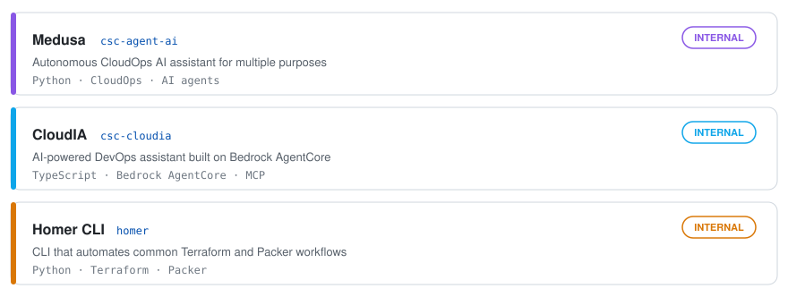
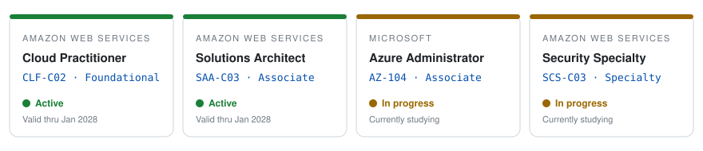

I design secure, automated **AWS infrastructure** for 130+ public-sector and enterprise clients.

---

### About

**Cloud Engineer & LLMOps @ IThinkUPC** — I design and operate mission-critical AWS infrastructure for public-sector and enterprise clients. My principle is simple: efficiency through automation — if you run it twice, script it; if three times, ship it as a tool. Beyond operations, I work on the infrastructure layer of LLMOps: observable systems that diagnose and heal themselves, built with Bedrock, MCP and RAG.

**Internal tooling I build and maintain**

<picture>
  <source media="(prefers-color-scheme: dark)" srcset="tools/tools-dark.svg" />
  <source media="(prefers-color-scheme: light)" srcset="tools/tools.svg" />
  
</picture>

**Certifications:**

<picture>
  <source media="(prefers-color-scheme: dark)" srcset="certs/certs-dark.svg" />
  <source media="(prefers-color-scheme: light)" srcset="certs/certs.svg" />
  
</picture>

---

### Stack

  

---

### Activity

 
<picture>
  <source media="(prefers-color-scheme: dark)" srcset="dist/github-snake-dark.svg" />
  <source media="(prefers-color-scheme: light)" srcset="dist/github-snake.svg" />
  
</picture>

